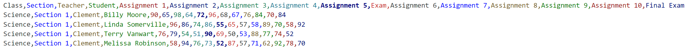
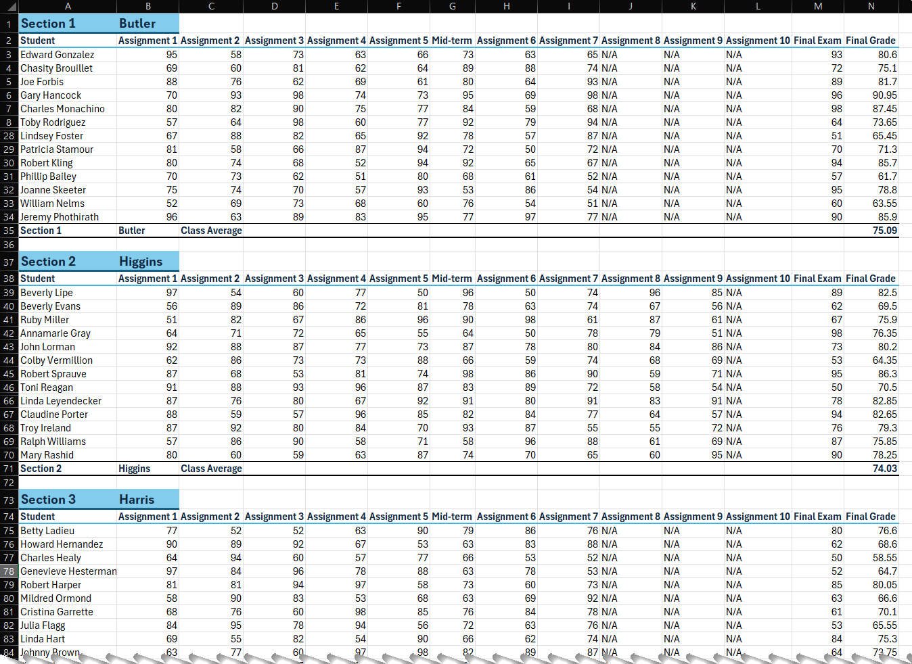
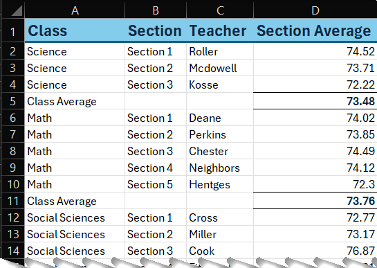

# End of Year Grading Challenge

## Real-world Challenge 1

You work in the office of a local high school. You need to calculate the average grade per student, per section/teacher, and per class. For example, you will need to create a worksheet for the English department, and in it you will list each section/teacher. For each section, list all the students and all their grades for assignments, the mid-term, and the final exam. You also need to calculate the final grade for each student, and the overall average for that section/teacher. Lastly, you will need a summary page that shows the section averages for each class, and the overall class average for all the sections.

You will run a simulator to create the data. But imagine that this is an extract from the grading system that all the teachers use. The extract is a CSV that lists student data in a tabular format. Note: The simulator code was created by GenAI and debugged by me.

## Sample finished Class worksheet

## GitHub Copilot Prompt

In order to generate the data for this exercise, I used GitHub Copilot. I started with this prompt:

*I need 5 classes of sample data. Each class has 20-30 students. Each student has 7-10 graded assignments depending on the class. After 5 assignments, there is an Exam grade. At the end, there is a Final Exam grade. Grades range from 50-98. Please generate the sample data in csv format.*

*For example:*

*Class,Student,Assignment 1,Assignment 2,Assignment 3,Assignment 4,Assignment 5,Exam,Assignment 6,Assignment 7,Assignment 8,Assignment 9,Assignment 10,Final Exam*

*Science,Joe Brady,87,78,92,80,85,75,83,86,84,78,N/A,81*

After several tries, and by dialing in the prompt, and debugging the code that GitHub Copilot gave me, I realizing that I needed to make the data more complicated, so I added multiple sections for each class/course of study.

## Final Prompt

After several revisions, I ended up with this prompt:

*I need 20 classes of sample data. Each class has 2-8 sections of 22-35 students. Each section has a teacher. Each student has 7-10 graded assignments depending on the class. After 5 assignments, there is an Exam grade. At the end, there is a Final Exam grade. Grades range from 50-98. Please generate the sample data in csv format. For example:*

*Class,Section,Teacher,Student,Assignment 1,Assignment 2,Assignment 3,Assignment 4,Assignment 5,Exam,Assignment 6,Assignment 7,Assignment 8,Assignment 9,Assignment 10,Final Exam*

*Science,Section 1,Buswell,Joe Brady,87,78,92,80,85,75,83,86,84,78,N/A,81*

*I need a Python function that will create the csv.*

The code that was generated was very helpful, but also it was not quite right. GitHub Copilot did not get the loop counter right. After adjusting and debugging the code, I ended up with the code in the Create Data notebook. I decided to use a Jupyter Notebook file, instead of a .py Python file, because you don't have to drop to a command line to run the code.

## Your Assignment

Run the Create Data python code to generate a sample dataset and save it as a CSV.

Use Python to check out the data to see what you're up against. Some things to consider: pandas can read csv files. Pandas dataframes can be grouped and groups can be counted.

---

1. Switch to VBA.
2. Record a macro named ImportData. While it's recording, import the CSV into Excel using VBA.
3. Continue recording to Rename the sample_class_data worksheet to "Raw Data" and delete Sheet1.
4. Highlight some cells as headings and some as accents so you can see the code in the macro for later.
5. Stop recording.
    a. Clean up the macro code, if necessary.
    b. Manually create a new Sheet1 and delete the Raw Data sheet.
    c. Run the macro. Make sure it imports the CSV and renames the tab to Raw Data.
6. Create a subroutine that breaks the CSV into one worksheet per Class.
    a. Put the Class, Section, and Teacher in Row 1. Highlight these cells.
    b. Put the students down the left in column A
    c. Put the names of the assignments in the second row.
    d. Put the grades at the intersection of the two.
    e. Stack the sections within each class worksheet.
7. Calculate the student's average grade for each class as follows: Each assignment is worth 5%, the mid-term exam is worth 20%, the final exam is worth the remainder to get to 100%.
8. Calculate the average final grade per Class/Section.
9. Calculate the average final grade per Class.
10. Create a summary page showing each Class/Section/Teacher and the average final grade for each section, it should look something like this:

Apply some formatting to show the class averages more prominently.
